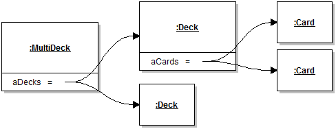

# Chapter 2 Solutions to Practice Exercises

## Exercise 1

Ultimately this reduces to an integer-to-binary base conversion problem. We need six boolean values (i.e., bits) because `ceil(log2(52))=6`. To make things a bit more interesting, we can split the problem into mapping the rank and the suit to bits separately, and create a mini-decision tree for the suit (red vs. black, high vs. low), and apply the standard base conversion algorithm for the rank. See [the complete solution](../solutions-code/chapter2/Card2.java). The impact of this design on the maintainers of class `Card` is unnecessary complexity. Assuming they don't need to look at the source code, there is *no impact* on the users of the class, because the new implementation respects the original interface.

## Exercise 2

The code can be found [here](../solutions-code/chapter2/EnumeratedCard.java). With the two helper methods to get the suit and rank of the card, the answer is pretty close to the original one. To have to calculate the rank and suit from indices has lower understandability and robustness than simply storing the information directly. However, the fact that the `Card` is an immutable enumerated type gives us a number of benefits, such as the certainty that there will never be duplicate cards in a program. Although it is not possible to create a card dynamically by specifying a suit and a rank, this issue can be addressed easily using a *static factory method* (`get`).

## Exercise 3

Notice how you can define the color enumerated type as an inner type of the `Suit` type, which makes sense, because this isn't any color, but the color of a card's suit. Note also that I could have had more compact code in `getColor` by working with the enumerated value's index, but that is brittle. The current code will work even if the order of enumerated values is changed.

```
public enum Suit
{
	CLUBS, DIAMONDS, SPADES, HEARTS;
		
	enum Color
	{
		RED, BLACK;
	}
		
	public Color getColor()
	{
		if( this == CLUBS || this == SPADES )
		{
			return Color.BLACK;
		}
		else
		{
			return Color.RED;
		}
	}
}
```

## Exercise 4

**Sketch:** There are many different ways to answer this question. For a single Joker, it would make sense to have an additional boolean field `aIsJoker`. The interesting questions to solve become, what should the rank and suit of a Joker be, and what should `getRank` and `getSuit` return for a joker? Experiment with design by contract and exception handling. This issue will be revisited in Chapter 4.

## Exercise 5

**Sketch:** An enumerated type seems like the right idea here to capture the type of joker. However, it is not a good idea to consider `null` to be a legal value for an enumerated type, so I would recommend including an enum value to represent the case where the card is not a joker. The issues of what to do with rank and suit of jokers is the same as for Exercise 4.

## Exercise 6

Assuming instances of class `Card` are immutable, it is acceptable to do the following, although we will see more elegant solutions in Chapter 3.

```
public List<Card> getCard()
{
	return new ArrayList<>(aCards);
}
```

## Exercise 7

The code of a partial solution can be found [here](../solutions-code/chapter2/MultiDeck.java). The solution leaves out the copying part of the exercise. To implement the object copying, you will need a way to copy `Deck` and `Card` instances. One way to do this at this point is simply to define copy constructors for these two classes.

## Exercise 8



## Exercise 9

The class is well encapsulated. The only part of the internal state returned is the inner `String`, but that is an immutable object.

---
<a rel="license" href="http://creativecommons.org/licenses/by-nc-nd/4.0/"></a>

Unless otherwise noted, the content of this repository is licensed under a <a rel="license" href="http://creativecommons.org/licenses/by-nc-nd/4.0/">Creative Commons Attribution-NonCommercial-NoDerivatives 4.0 International License</a>. 

Copyright Martin P. Robillard 2019