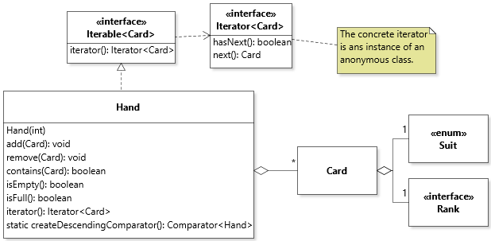
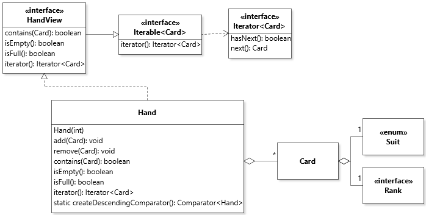
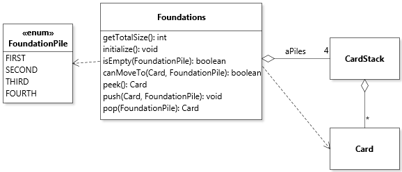

# Chapter 3 Solutions to Practice Exercises

## Exercise 1-3

See [Hand.java](../solutions-code/chapter3/Hand.java).

## Exercise 4

[Diagram File](c3-exercise4.class.jet)

## Exercise 5

See [Hand.java](../solutions-code/chapter3/Hand.java).

## Exercise 6

See [UniversalComparator.java](../solutions-code/chapter3/UniversalComparator.java).

## Exercise 7

See [Hand.java](../solutions-code/chapter3/Hand.java).

## Exercise 8

[Diagram File](c3-exercise8.class.jet)

## Exercise 9

*Solution intentionally not provided.*

## Exercise 10

See [SortedHand.java](../solutions-code/chapter3/SortedHand.java).

## Exercise 11

[Diagram File](c3-exercise11.class.jet)

The code is a direct translation of the diagram.

## Exercise 12

[Diagram File](c3-exercise12.class.jet)

The details can vary. I chose to only include the methods in `Foundations` because that is the focus of the diagram. My modeling of the enumerated type is also a bit unorthodox in that I put in the field values (which should be underlined to show they are static, but that is not supported by JetUML, and the information can be inferred from the `enum` stereotype). I also named the association to `CardStack`, but left the association between `CardStack` and `Card` anonymous because, again, the focus was on the design of `Foundations`.

---

Unless otherwise noted, the content of this repository is licensed under a <a rel="license" href="http://creativecommons.org/licenses/by-nc-nd/4.0/">Creative Commons Attribution-NonCommercial-NoDerivatives 4.0 International License</a>. 

Copyright Martin P. Robillard 2019