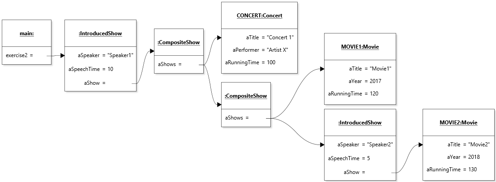

# Chapter 6 Solutions to Practice Exercises

## Exercise 1

The following is a sample [Composite](../solutions-code/chapter6/CompositeShow.java) and [Client](../solutions-code/chapter6/CompositeShow.java) (first block). Other approaches are possible to specify and enforce the cardinality constraint for initializing the composite show, e.g., design by contract or overloaded constructors.

## Exercise 2

The following is a sample [Decorator](../solutions-code/chapter6/IntroducedShow.java) and [Client](../solutions-code/chapter6/CompositeShow.java) (second block). 

## Exercise 3


[Diagram file](c6-exercise3.class.jet)

## Exercise 4



[Diagram file](c6-exercise4.object.jet)

## Exercise 5


[Diagram file](c6-exercise5.sequence.jet)

## Exercise 6

The first steps are to create helper classes [CompositeIcon](../solutions-code/chapter6/CompositeIcon.java) and [ShiftedIcon](../solutions-code/chapter6/ShiftedIcon.java). Then a method to create the desired icon becomes relatively simple. Assuming `SHIFT_X` and `SHIFT_Y` denote `int` values that represent a number of pixels.

```java
private Icon createHandIcon(Card[] pHand, boolean pHidden)
{
	CompositeIcon result = new CompositeIcon();
	for( int i = 0; i < pHand.length; i++ )
	{
		result.addIcon(new ShiftedIcon(pHidden?CardImages.getBack():CardImages.getCard(pHand[i]), SHIFT_X, SHIFT_Y));
	}
	return result;
}

```


---
<a rel="license" href="http://creativecommons.org/licenses/by-nc-nd/4.0/"></a>

Unless otherwise noted, the content of this repository is licensed under a <a rel="license" href="http://creativecommons.org/licenses/by-nc-nd/4.0/">Creative Commons Attribution-NonCommercial-NoDerivatives 4.0 International License</a>. 

Copyright Martin P. Robillard 2019