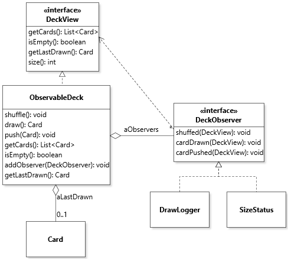
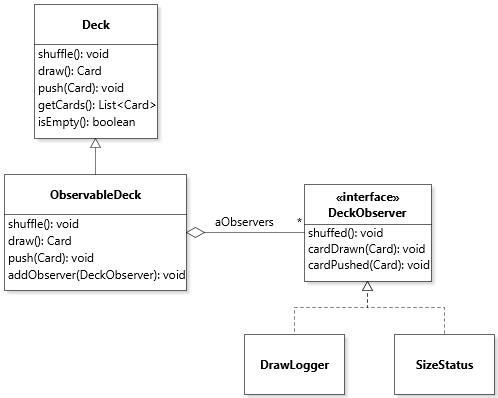
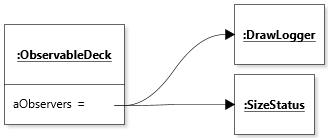
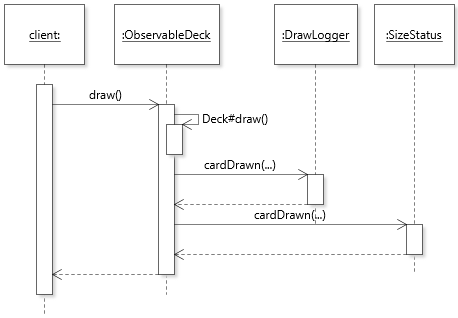
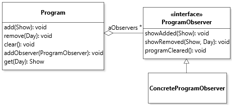
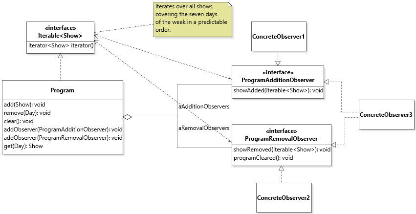

# Chapter 8 Solutions to Practice Exercises

## Exercise 1

Different variants are possible. Here is my chosen solution.


[Diagram file](c8-exercise1.class.jet)

[ObservableDeck1.java](../solutions-code/chapter8/ObservableDeck1.java)

The challenge in this question was that `SizeStatus` requires the size of the `ObservableDeck`, so it's tempting to push this information through the callbacks. However, an important principle for applying the Observer pattern is that the callbacks should reflect state changes on the model, and the data passed to callbacks should be consistent with this. The anti-pattern in this case is to overfit the design of the Observer interface to what a specific concrete observer might need. So in this case I followed the hard line and designed my three callbacks to map as directly as possible to the state changing methods of the model, and built a workaround in the `SizeStatus`, namely to compute the current size of the deck based solely on information received through the callbacks (and the assumption that the deck has 52 cards).

## Exercise 2

Different variants are possible. Here is my chosen solution.



[Diagram file](c8-exercise2.class.jet)

[ObservableDeck2.java](../solutions-code/chapter8/ObservableDeck2.java)

Here the challenge lay elsewhere, namely that normally a deck does not store cards drawn. With the pull model, this potentially useful information would become irremediably unavailable to the observers, so it becomes necessary to keep it. Ultimately, it might be a good idea to combine data pushing and pulling for an Observable deck.

## Exercise 3

The idea of factoring out some functionality into a super class is for that functionality to be reusable across different subclasses. For this reason, the general observable behavior needs to be general enough to work on multiple applications of the Observer patterns. To take it to the limit, I wrote a solution that uses the very general (but not generic!) support offered by [`java.util.Observable`](https://docs.oracle.com/javase/8/docs/api/java/util/Observable.html).

[ObservableDeck3.java](../solutions-code/chapter8/ObservableDeck3.java)

Some of the advantages of this solution are that the code of `ObservableDeck3` is now decluttered from any observer-related code expect for the notification calls. In fact, it might even make sense to call it simply `Deck`. It's also not necessary to define a new `Observer` interface, because that is in the library. 

The disadvantages are numerous:

* If we also want an instance of `Deck` that is *not* observable, we need to duplicate a lot of the class's code;
* Because Java is single-inheritance, it is not possible to have a design where `ObservableDeck` is a subclass of a class besides `Observable`; 
* We cannot design individual callbacks specific to our situation, we have to rely on a single general one offered by `Observer` and use an event type instead;
* The code we write to use `java.util.Observer` is brittle because of the downcasts required.

## Exercise 4

The first part of the solution is to declare `ObservableDeck` to extend `Deck` and declare the extra field to hold a list of observers, and a method to add to that list:

```java
public class ObservableDeck extends Deck
{
	private final List<DeckObserver> aObservers = new ArrayList<>();
	
	public void addObserver(DeckObserver pObserver)
	{
		assert pObserver != null;
		aObservers.add(pObserver);
	}
```

Then each state-changing method needs to be redefined so it triggers observer notifications:


```java
public void shuffle()
{
   super.shuffle();
   for(DeckObserver1 observer : aObservers)
   {
      observer.shuffled();
   }
}

public void push(chapter2.Card pCard)
{
   super.push(pCard);
   for(DeckObserver1 observer : aObservers)
   {
      observer.cardPushed(pCard);
   }
}
	
public Card draw()
{
   Card card = super.draw();
   for(DeckObserver1 observer : aObservers)
   {
      observer.cardDrawn(card);
   }
   return card;
}

```

The rest of the solution from Exercise 1 can remain unchanged. For this particular application of the pattern, this use of inheritance works relatively well. The code handling the observer functionality is isolated in one class, it's possible to have both `Deck` and `ObservableDeck` without much code duplication, and retain the flexibility to have our own `Observer` interface and callbacks.

## Exercise 5



[Diagram file](c8-exercise5.class.jet)



[Diagram file](c8-exercise5.object.jet)



[Diagram file](c8-exercise5.sequence.jet)

## Exercise 6



[Diagram file](c8-exercise6.class.jet)

## Exercise 7



[Diagram file](c8-exercise7.jet)


---
<a rel="license" href="http://creativecommons.org/licenses/by-nc-nd/4.0/"></a>

Unless otherwise noted, the content of this repository is licensed under a <a rel="license" href="http://creativecommons.org/licenses/by-nc-nd/4.0/">Creative Commons Attribution-NonCommercial-NoDerivatives 4.0 International License</a>. 

Copyright Martin P. Robillard 2019